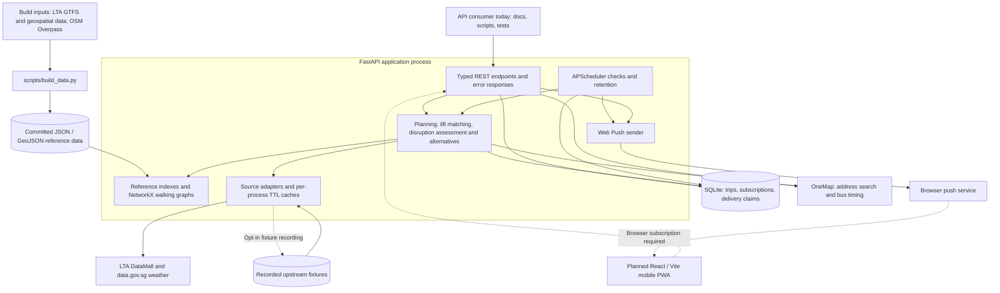

# PS2 — Current architecture

Reviewed against `main` at `8f87265`, 18 September 2026. This describes implemented
code, with future browser capabilities explicitly separated below.

## Presentation overview

The Smart Commuter Companion helps Mdm Lim plan a step-free trip from Bedok to
Singapore General Hospital. A Python backend combines a prepared walking network
and rail timetable with current transport reports, stores her journey, and exposes
typed APIs for a mobile web client. Scheduled checks can send warnings before travel.

The architecture has three parts: a build-time data preparation pipeline, a FastAPI
application with local storage, and external data/push services. The frontend is
still planned; there is no implemented mobile interface or speech feature yet.



All boxes inside the application process are Python modules, not independently
deployed services. Hosting, the frontend build, and the map tile provider are not
established by this diagram. External retrieval uses HTTP; public API payloads are JSON.

## Data ownership and caching

| Layer | Contents | Lifecycle and owner |
|---|---|---|
| Build-time raw cache | Downloaded source material | `scripts/build_data.py`; local `data/cache/`, excluded from Git |
| Reference artifacts | Stations, exits, line aliases, ride times, headways, bus options, walking graph and covered ways | Committed under `backend/data/derived/`; refreshed by rebuilding, not by a request |
| Reference memory | Loaded artifacts, station/exit lookups, NetworkX graphs | `app/data.py`; cached within each process |
| Upstream memory | Latest response per configured source | `app/sources/base.py`; TTL cache and fetch lock within each process |
| Recorded fixtures | Captured upstream payloads with capture times | `backend/data/fixtures/`; fallback; updates require `PS2_RECORD_FIXTURES` |
| SQLite | Trip origin, preferences, appointment, original/effective plans; push subscriptions; delivery claims | `app/store.py`; default `backend/data/ps2.sqlite3`, configurable with `PS2_DB` |
| Browser storage | Intended saved offline bundle and app shell | Planned frontend responsibility; not implemented |

Configured source TTLs: bus arrivals 20 seconds; lifts and train alerts 60 seconds;
weather 300 seconds; crowding 600 seconds; taxi stands 24 hours. Expiry triggers no
work by itself: a subsequent request or scheduled check fetches again. On failure,
the source adapter returns its last good in-memory value, then a readable fixture,
with stale metadata; without either it raises for the caller to handle.

OneMap calls do not use the generic TTL cache. There is no Redis, shared distributed
cache, continuous feed ingestion, or historical upstream database. SQLite stores
application state, not the whole transport network. Cache contents disappear when
their application process exits.

## How identifiers are reconciled

| Mismatch | Current resolution | Evidence |
|---|---|---|
| Different line codes | Explicit canonical-line/alias mapping compiled into `line_codes.json` | `scripts/build_data.py`, `data.canonical_line` |
| Multiple line codes at one interchange | GTFS parent-station grouping; e.g. EW16 / NE3 / TE17 share a physical station | `data.station_by_code` |
| Different station and exit label formats | Build-time name/suffix/case normalization and station-scoped exit references | `scripts/build_data.py`, `data.exits_by_station` |
| OSM entrances associated with stations | Name comparison with geographic fallback; result cached by OSM ID | `WalkGraph.station_of_entrance` |
| Free-text lift descriptions | Reusable parser extracts all named exits, validates against known station exits, and reports matched/unmatched/station-only resolution | `services/lifts.py` |

Mappings include explicitly maintained domain knowledge; this is not automatic
entity resolution or an LLM. Runtime parsing still happens when assessing reports,
but the reference tables and rules are reused. Missing exit data cannot be recovered
merely by changing the label: unresolved matches remain uncertainty the UI must show.

## A journey through the backend

```mermaid
sequenceDiagram
    participant C as API consumer
    participant A as FastAPI
    participant S as Sources and assessment
    participant P as Planner and reference graph
    participant D as SQLite
    C->>A: POST /api/trips
    A->>A: Validate origin/preferences; normalize appointment to SGT
    A->>S: Read lift reports through cache/fallback
    A->>P: Build effective plan and clear-day baseline
    P-->>A: Walking legs, fixed rail leg, timing window
    A->>D: Store original and effective plans
    A-->>C: TripPlan and trip ID
    C->>A: GET /api/trips/{id}/status
    A->>D: Load trip
    A->>S: Assess lifts, disruption, crowd and weather
    A->>P: Replan when blocked-exit signature changes
    A->>D: Persist effective plan / failure state
    A-->>C: RouteStatus including freshness and reroute state
    C->>A: GET /api/trips/{id}
    A->>D: Read effective plan
    A-->>C: Updated TripPlan
```

The rail journey is scoped to EW5 → EW16, not a general multimodal network search.
Walking uses a prepared OSM graph with staircase edges excluded. Timing combines
scheduled rail ride time, headway around boarding time, walking-pace assumptions,
and an appointment buffer. The planner rejects unsupported origins.

`GET /status` has a persistence side effect: it can revise the stored plan. When an
outage clears, the original plan supports restoring the route. If replanning fails,
the response warns that retained steps may be unusable. A frontend must retrieve the
effective plan after checking status before presenting or speaking updated steps.

Alternatives combine assessed disruption with direct-bus reference data, bus arrival
reports, optional OneMap timing, and barrier-free taxi-stand data. Missing timing is
left unknown. `GET /offline` attempts a status refresh and packages the plan, status
snapshot, warnings, and plain steps. It supplies no offline map tiles; actual offline
storage and rendering are browser work still to be built.

## Scheduled checks and notifications

`jobs.py` starts with the application lifespan. At 20:00 Singapore time it checks
tomorrow's appointments; at 07:00 it checks appointments later that day. It evaluates
reported conditions, not predicted future outages. Scheduled checks exclude the
process-wide demo scenario. The notification path assesses conditions; it does not
run the `/status` replan workflow.

Subscriptions are filtered by trip ID. Delivery claims are stored per trip, dated
check, and endpoint; failed deliveries release their claims, and expired endpoints
are removed. This allows a later invocation to retry; it is not a dedicated retry
queue. Retention runs at startup and hourly, deleting trips more than 24 hours past
their appointment and subscriptions whose linked trips are all gone.

The scheduler and SQLite are part of the deployment requirements: an always-running
process is needed for scheduled checks and durable storage is needed for persistence.
Each application worker has its own memory cache, scheduler, and scenario state.
Do not present this as an already-designed distributed deployment.

## Current boundaries to state during a presentation

- Frontend, service worker, map UI, and read-aloud controls are planned. The backend
  has typed Pydantic response schemas in `app/api/schemas.py` and serves OpenAPI.
- Data freshness and provenance are separate: a recorded real response can have
  `source: live` while also being stale. Demo injection is labelled simulated.
- `PS2_USE_FIXTURES` is not a universal network firewall: the generic source adapter
  can fetch when a fixture is missing. Address search explicitly refuses fixture
  mode; the OneMap bus-timing path still calls its adapter. Avoid claiming all paths
  are guaranteed network-free.
- No live user-position or journey-progress tracking exists. Station interiors are
  not comprehensively modeled. Accessibility uncertainty must remain visible.
- Tile provision, browser offline caching, and hosting remain implementation choices.
- Trip IDs are bearer-like access identifiers; there is no account/login system.

## Source map and presentation script

Read `app/main.py` for startup and API wiring; `app/api/schemas.py` for payloads;
`app/services/` for planning and interpretation; `app/sources/` for upstream access;
`app/data.py` for reference indexes; `app/store.py` for persistence; `app/jobs.py`
for scheduling; and `scripts/build_data.py` for prepared datasets.

Suggested 45-second explanation:

> We prepare the walking network and timetable before the app runs, so route planning
> does not depend on downloading a map dataset for every request. Our FastAPI backend
> combines those references with cached transport and weather reports, then saves an
> original and effective journey in SQLite. A status refresh can reroute around known
> lift outages, while scheduled evening and morning checks send subscribed devices
> warnings. When a source fails, recorded data can keep the experience useful, with its
> age disclosed. The next layer is our mobile interface, including saved written steps
> and user-triggered read-aloud guidance.

Related: [API contract](PS2_API_CONTRACT.md), [backend plan](PS2_BACKEND_PLAN.md),
[frontend planning backlog](PS2_FRONTEND_PLAN.md), [decision record](PS2_DECISION_RECORD.md).
