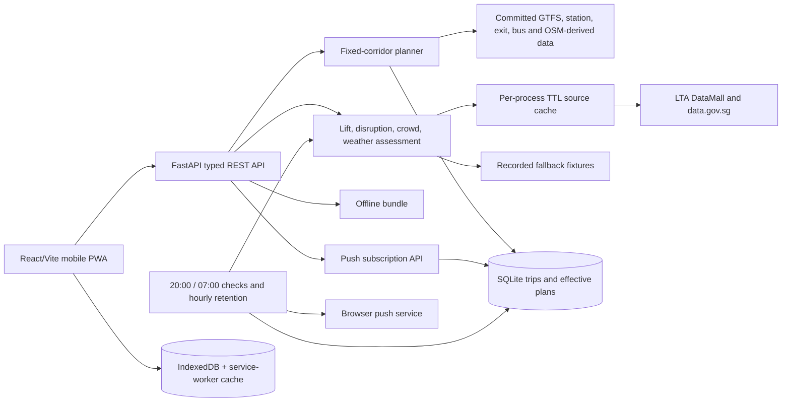

# PS2 Product and Technical Completion Plan

> **For agentic workers:** REQUIRED SUB-SKILL: Use superpowers:subagent-driven-development (recommended) or superpowers:executing-plans to implement this plan task-by-task. Steps use checkbox (`- [ ]`) syntax for tracking.

**Goal:** Turn the current Bedok-to-SGH specialist prototype into a production-ready mobile companion, add safe user-triggered read-aloud guidance, and make an explicit product decision about broader station and destination support.

**Architecture:** Keep the existing React/Vite PWA and FastAPI service, but treat journey state as one coherent snapshot across planning, status, offline storage, notifications, and speech. General routing must be added below the API boundary; a frontend station picker alone cannot expand the journeys the backend can calculate.

**Tech Stack:** React 19, TypeScript, Vite PWA, Web Speech API, FastAPI, Pydantic, SQLite, APScheduler, NetworkX, LTA/GTFS/OneMap/OSM-derived data.

---

## 1. Executive answer

Yes: the implemented planner supports one product journey, not arbitrary station pairs.
The destination is Singapore General Hospital and the rail segment is fixed to Bedok
MRT (`EW5`) to Outram Park (`EW16`). The origin address may vary only while it can
snap into the prepared Bedok walking graph. This is intentional in the original
persona decision (`PS2_DECISION_RECORD.md`, D14), and it is enforced in code rather
than being a frontend-only limitation.

That does not make the backend a mock. Within this corridor it performs meaningful
planning and live-status work: step-free walking paths, entrance and exit selection,
scheduled train timing, lift-outage rerouting, disruption/crowd/weather assessment,
alternatives, offline bundles, persistence, and scheduled push checks. The accurate
description is **a specialist journey backend for one repeat medical trip**, not a
general Singapore journey planner.

The repository contains broader rail reference data, but broad data coverage is not
the same as broad routing support. The runtime planner, walking graphs, disruption
intersection, lift checks, alternatives, API validation, and UI are all specialised
to the Bedok-to-SGH journey. Removing two constants would produce incorrect routes.

## 2. Current architecture and data flow

### Data that is queried at runtime

| Need | Runtime behaviour | Cache or persistence |
|---|---|---|
| Saved trip and effective reroute | Read/write locally | SQLite |
| Station, line, exit, ride-time and headway reference data | Load committed derived files | Python `lru_cache`, per process |
| Walking path | Run NetworkX against prepared Bedok/Outram graphs | Graph held in process memory |
| Lift and train alerts | Query LTA adapters | 60-second per-process TTL, then stale memory/fixture fallback |
| Weather | Query data.gov.sg adapter | 300-second per-process TTL |
| Crowd | Query LTA adapter | 600-second per-process TTL |
| Bus arrival | Query LTA adapter | 20-second per-process TTL |
| Taxi stands | Query LTA adapter | 24-hour per-process TTL |
| Address and optional public-transport timing | Query OneMap | No shared generic TTL cache |
| Offline journey | Download bundle to browser | IndexedDB implementation exists but recovery is incomplete |

There is no Redis, shared cache, continuously ingested transport database, or
historical feed store. SQLite stores user journey state and push-delivery claims,
not the transport network. Memory cache contents vanish on process restart and are
not shared between workers.

### How label conflicts are handled

Reconciliation is reusable and mostly data-driven, not rewritten on every request:

- `scripts/build_data.py` compiles line aliases and GTFS parent-station groupings.
- `app/data.py` loads canonical station, line, interchange and exit indexes.
- OSM entrances are associated by normalised names with geographic fallback.
- `services/lifts.py` parses free-text `LiftDesc`, then validates extracted exits
  against the known exits for that station.
- Unresolved data remains `unknown`; it is not silently treated as accessible.

There is still maintained domain knowledge in these rules and derived tables. It is
not an LLM or automatic entity-resolution service.

## 3. What the backend does today

| Capability | Implemented behaviour | Important boundary |
|---|---|---|
| Plan a trip | Door-to-door walk → EWL → walk plan with leave-by and arrival range | Only Bedok walking area → SGH via EW5 → EW16 |
| Accessibility | Excludes mapped stairs, selects usable station entrances/exits | Station interiors are not comprehensively modelled |
| Lift disruption | Parses outage reports and persists a changed exit/route | Checks only the fixed origin and destination stations |
| Train disruption | Intersects alerts with EW5…EW16 westbound | Route and direction are fixed constants |
| Weather/crowd | Adds provenance, freshness, shelter preference and crowd badges | No prediction and no live user location |
| Alternatives | Direct Bedok–SGH buses, leave-earlier advice, taxi stand | Anchored to the same origin/destination corridor |
| Offline | Returns plan, status snapshot, warnings and plain steps | No permitted offline map-tile provider selected |
| Reminders | Scheduled 20:00 previous-day and 07:00 same-day checks | Requires an always-running backend; not continuous monitoring |
| Persistence | Stores original/effective plans, subscriptions and delivery claims | Trip IDs act like bearer links; there are no accounts |
| Demo resilience | Recorded fixtures and explicit simulated scenarios | Fixture mode is not a universal network firewall |

## 4. Why only Bedok to SGH works

The restriction appears in every layer that would need to become route-aware:

| Layer | Concrete restriction |
|---|---|
| Product decision | D14 defines one persona and one repeat medical journey |
| API | `POST /api/trips` rejects `destination_id != "SGH"`; `/destinations` returns only SGH |
| Configuration | `ORIGIN_STATION = "EW5"`, `DEST_STATION = "EW16"`, fixed SGH coordinate |
| Planner | Fixed `EWL`, direction, EW5/EW16, and walk → rail → walk shape |
| Walking data | OSM graph is built only for the Bedok and Outram bounding boxes |
| Disruptions | `HER_LINE = "EWL"`; affected stations are hard-coded as EW5…EW16 |
| Lift matching | Runtime assessment iterates only the origin and destination constants |
| Alternatives | Bus, OneMap and taxi queries are anchored to Bedok and SGH |
| Frontend | Presents the supported corridor rather than a misleading general route selector |

The build pipeline already derives stations, line aliases, headways, and many
station-pair ride times across the rail feed. That is useful groundwork. It does
not yet provide transfer-aware pathfinding, first/last-mile walking coverage, or
route-specific live assessment.

## 5. Scope options and feasibility

| Product scope | What users could enter | Effort | What is actually required |
|---|---|---:|---|
| A. Current specialist | Bedok-area address → SGH | Already built | Finish frontend safety/reliability work |
| B. Supported-corridor registry | A curated set of repeat journeys | Small–medium per corridor | Corridor config, walking extracts, fixtures and tests per route |
| C. Any station on one line → SGH | A supported MRT station → SGH | Medium | Dynamic direction/timing, route segment, station access data, disruptions and lifts |
| D. Any MRT station pair | Station → station, including transfers | Large | Rail graph search, transfer modelling, route-aware status and lift handling |
| E. Any Singapore address pair | Door-to-door multimodal trip | Very large | Islandwide walking/access graph, geocoding, multimodal search, alternatives and operations |

Recommendation: retain Scope A for the assessed persona build unless the product
brief has changed. If expansion is required, implement Scope C first and prove the
route-domain model before attempting transfers or arbitrary addresses. Scope B is
the quickest way to support a small number of known hospital journeys, but it
accumulates corridor-specific data and should not be marketed as general routing.

## 6. Unfinished frontend and operational functionality

Priority is based on safety and user-visible correctness.

### P0 — journey consistency and offline truthfulness

- Offline saving currently bypasses the journey coordinator even though requesting
  an offline bundle can trigger a replan. The visible plan and saved plan can diverge.
- A cold offline deep link can fail before saved IndexedDB content hydrates because
  the service worker has no navigation fallback.
- Offline hydration omits generated time, expiry, bundle warnings and plan-level
  replan failure.
- After a failed refresh, a retained old status can still look like a fresh all-clear.

### P1 — lifecycle and production behaviour

- Add visible-page polling with backoff, plus refresh on reconnect and visibility.
- Complete push enrollment restoration, unsubscribe, development failure handling,
  safe same-origin notification navigation, and real-device testing.
- Move the active-trip pointer out of fragile `localStorage` or make its failure
  explicit and recoverable.
- Report partial deletion outcomes without claiming all local/server data is gone.
- Add the route sketch, update prompt, complete alternative details, demo push path,
  and production-grade accessibility/offline browser coverage.
- Decide hosting, HTTPS, durable SQLite volume and single-scheduler deployment. A
  multi-worker deployment currently duplicates process-local schedulers and caches,
  even though SQLite claims prevent duplicate delivery in common cases.

## 7. Read-aloud feature scope

The desired first version is feasible as a small frontend feature. It reads the
current journey or status aloud after a user tap. It is not a conversational AI,
does not use a microphone, does not track progress, and does not require an LLM or
paid speech backend.

Use browser speech synthesis behind two boundaries:

- A pure formatter converts the typed coherent journey snapshot into concise speech.
- A speech adapter owns feature detection, voice selection, cancellation and events.

Controls are **Read journey**, **Read status**, **Repeat**, and **Stop**. Speech must
be cancelled when the trip changes, navigation leaves the journey, or a route update
makes the spoken directions obsolete. A failed replan must speak the warning and
must not continue with directions known to be unsafe. Offline age and warnings are
spoken before offline directions. All spoken content remains visible in text, and
voice quality/offline availability is explicitly device-dependent.

## 8. Recommended implementation sequence

The frontend reliability work and read-aloud feature can ship without broadening the
route planner. General routing should be a separately reviewed backend programme.

### Task 1: Serialize offline saves with journey refresh

**Files:**

- Modify: `PS2/frontend/src/features/journey/journeyCoordinator.ts`
- Modify: `PS2/frontend/src/features/offline/SaveOfflineButton.tsx`
- Test: `PS2/frontend/src/features/journey/journeyCoordinator.test.ts`

- [ ] Add a coordinator operation that obtains the offline bundle, accepts its
  effective plan/status as one snapshot, and prevents concurrent stale commits.
- [ ] Write a failing test where a status refresh and offline save resolve out of
  order; assert that the newest coherent snapshot wins.
- [ ] Route `SaveOfflineButton` through that operation and persist only its result.
- [ ] Run `npm test -- --run journeyCoordinator` from `PS2/frontend`; expect PASS.
- [ ] Commit as `fix(frontend): serialize offline journey snapshots`.

### Task 2: Make offline deep links recoverable and explicit

**Files:**

- Modify: `PS2/frontend/src/sw.ts`
- Modify: `PS2/frontend/src/features/offline/storage.ts`
- Modify: `PS2/frontend/src/features/journey/JourneyProvider.tsx`
- Create: `PS2/frontend/e2e/offline.spec.ts`

- [ ] Add same-origin navigation fallback to the precached application shell.
- [ ] Persist and hydrate bundle creation time, expiry, warnings, status and
  `replan_failed` alongside the plan.
- [ ] Hydrate a matching saved trip before treating a network 404 as final.
- [ ] Add a Playwright production-build test: create/save a trip, reload its deep
  link offline, and assert that the stale timestamp and warnings are visible.
- [ ] Run `npm run build` and `npx playwright test e2e/offline.spec.ts`; expect PASS.
- [ ] Commit as `fix(frontend): restore saved journeys offline`.

### Task 3: Prevent stale status from reading as current

**Files:**

- Modify: `PS2/frontend/src/features/journey/journeyCoordinator.ts`
- Modify: `PS2/frontend/src/features/journey/StatusPanel.tsx`
- Test: `PS2/frontend/src/features/journey/StatusPanel.test.tsx`

- [ ] Represent `fresh`, `stale`, `failed`, and `checking` states explicitly.
- [ ] Add a failing test in which a prior all-clear is followed by a failed refresh;
  assert that the UI says the last check could not be updated and shows its age.
- [ ] Add polling only while visible, exponential backoff after failures, and refresh
  on `online` and `visibilitychange` events.
- [ ] Run the focused tests and the full `npm test -- --run`; expect PASS.
- [ ] Commit as `fix(frontend): qualify retained journey status`.

### Task 4: Complete push and deletion lifecycle

**Files:**

- Modify: `PS2/frontend/src/api/push.ts`
- Modify: `PS2/frontend/src/features/push/ReminderControls.tsx`
- Modify: `PS2/frontend/src/features/settings/SettingsPage.tsx`
- Modify: `PS2/frontend/src/features/planning/activeTrip.ts`
- Create: `PS2/frontend/src/features/push/ReminderControls.test.tsx`
- Create: `PS2/frontend/e2e/settings.spec.ts`

- [ ] Restore subscription state on load and place a bounded timeout around service
  worker readiness.
- [ ] Add unsubscribe and make server/local partial failures visible.
- [ ] Validate notification targets using `new URL(target, self.location.origin)` and
  reject any URL whose `origin` differs from the application origin.
- [ ] Add reload, denied-permission, expired-subscription, and partial-delete tests.
- [ ] Run unit, Playwright, lint, typecheck and build; expect all commands to pass.
- [ ] Commit as `fix(frontend): complete reminder and deletion lifecycle`.

### Task 5: Implement read-aloud from the coherent snapshot

**Files:**

- Create: `PS2/frontend/src/features/read-aloud/buildSpeechText.ts`
- Create: `PS2/frontend/src/features/read-aloud/buildSpeechText.test.ts`
- Create: `PS2/frontend/src/features/read-aloud/speechAdapter.ts`
- Create: `PS2/frontend/src/features/read-aloud/speechAdapter.test.ts`
- Create: `PS2/frontend/src/features/read-aloud/ReadAloudControls.tsx`
- Modify: `PS2/frontend/src/features/journey/JourneyPage.tsx`

- [ ] Define typed inputs from the generated API types and the coordinator snapshot.
- [ ] Test normal, rerouted, stale, simulated, offline, unavailable-status and failed-
  replan wording before implementing the formatter.
- [ ] Implement a `speechSynthesis` adapter whose `speak` always cancels the previous
  utterance and whose `dispose` cancels on unmount or trip change.
- [ ] Add accessible Read journey, Read status, Repeat and Stop controls with visible
  speaking/error state and a text-only fallback.
- [ ] Test repeated taps, route changes, unsupported synthesis, voice-list delay,
  synthesis errors and cleanup.
- [ ] Run unit tests, then manually verify Safari on iPhone and Chrome on Android;
  record station-name pronunciation and locked-screen/offline limitations.
- [ ] Commit as `feat(frontend): add journey read-aloud controls`.

### Task 6: Introduce a route-domain model before any station picker

**Files:**

- Create: `PS2/backend/app/services/rail_graph.py`
- Create: `PS2/backend/tests/test_rail_graph.py`
- Modify: `PS2/backend/app/services/planner.py`
- Modify: `PS2/backend/app/api/schemas.py`

- [ ] Define `RailPath`, `RailSegment` and `Transfer` types containing ordered station
  codes, route, direction, headsign and transfer accessibility metadata.
- [ ] Build the graph from committed station and GTFS-derived route sequences.
- [ ] First test same-line eastbound/westbound paths, invalid stations, service gaps,
  Changi branch behaviour and deterministic tie-breaking.
- [ ] Then test one-transfer journeys without exposing them through the public API.
- [ ] Replace fixed rail-leg construction only after EW5→EW16 output remains contract-
  compatible in regression tests.
- [ ] Run `pytest tests/test_rail_graph.py tests/test_trips.py -q`; expect PASS.
- [ ] Commit as `feat(backend): model dynamic rail paths`.

### Task 7: Make status and lift assessment route-aware

**Files:**

- Modify: `PS2/backend/app/services/disruption.py`
- Modify: `PS2/backend/app/services/lifts.py`
- Modify: `PS2/backend/app/api/status.py`
- Modify: `PS2/backend/tests/test_labelling_and_alternatives.py`
- Modify: `PS2/backend/tests/test_lift_outages.py`
- Modify: `PS2/backend/tests/test_route_honesty.py`

- [ ] Pass the calculated `RailPath` into disruption and lift assessment instead of
  reading `HER_LINE`, `HER_STATIONS`, `ORIGIN_STATION`, or `DEST_STATION` globals.
- [ ] Test direction-specific partial overlap, interchange aliases, multiple segments,
  transfer-station lifts, unmatched exit text and cleared outages.
- [ ] Persist a newly calculated effective plan and retain the last plan with a strong
  warning if safe replanning fails.
- [ ] Run the three focused suites and full backend suite; expect PASS.
- [ ] Commit as `feat(backend): assess conditions on calculated routes`.

### Task 8: Expand first/last-mile coverage for the chosen product scope

**Files:**

- Modify: `PS2/backend/scripts/build_data.py`
- Modify: `PS2/backend/app/data.py`
- Modify: `PS2/backend/app/services/walking.py`
- Create: `PS2/backend/tests/test_walking_coverage.py`
- Create: `PS2/backend/tests/test_build_data.py`

- [ ] Record the chosen scope in `PS2_DECISION_RECORD.md`: selected stations/corridors,
  maximum snap distance, refresh cadence, data licence and storage size budget.
- [ ] For Scope C, build bounded access graphs around every supported boarding station
  and the SGH destination. For Scope E, design an islandwide tiled graph instead of
  loading one monolith into every process.
- [ ] Add coverage validation that fails the build if a supported station lacks a
  reachable step-free entrance or an explainable `unknown` state.
- [ ] Measure graph size, build time, application startup, path latency and memory.
- [ ] Commit as `feat(data): expand supported step-free access graphs`.

### Task 9: Generalise the API, alternatives and frontend selection

**Files:**

- Modify: `PS2/backend/app/api/trips.py`
- Modify: `PS2/backend/app/services/alternatives.py`
- Modify: `PS2/backend/app/api/schemas.py`
- Modify: `PS2/PS2_API_CONTRACT.md`
- Modify: `PS2/frontend/src/features/planning/AppointmentForm.tsx`
- Regenerate: `PS2/frontend/src/api/generated.d.ts`

- [ ] Replace the single SGH validation with explicit supported origin/destination
  objects and return capability metadata explaining unsupported areas.
- [ ] Calculate bus/taxi alternatives from the actual endpoints and omit an option
  when reliable data is unavailable.
- [ ] Add station/destination selection only after the backend returns supported
  choices; never allow the UI to imply arbitrary coverage.
- [ ] Add contract tests for supported, unsupported, reverse-direction and transfer
  routes; retain Bedok→SGH as a golden regression.
- [ ] Regenerate OpenAPI types, run both full suites, and exercise representative
  mobile journeys end to end.
- [ ] Commit as `feat(product): support selected journey pairs`.

### Task 10: Production gate

**Files:**

- Create: `PS2/PRODUCTION_READINESS.md`
- Modify: deployment configuration selected by the team

- [ ] Choose a single active scheduler or external job runner; document worker count.
- [ ] Put SQLite on durable storage or migrate its tiny state model to a managed DB.
- [ ] Configure HTTPS, CSP, CORS, secret injection, logging and health checks.
- [ ] Run accessibility, offline, slow-network, stale-feed, upstream-failure, push,
  retention, route-regression and mobile performance suites.
- [ ] Record p95 plan/status latency, PWA asset weight, memory use and recovery steps.
- [ ] Commit as `docs(ops): add production readiness evidence`.

## 9. Acceptance gates

The current specialist release is ready when:

- Every displayed/spoken plan and status comes from one coherent snapshot.
- Offline deep links work in a production build and always disclose age/limitations.
- A failed refresh cannot read as a current all-clear.
- Push subscription, unsubscribe and deletion recover honestly from partial failures.
- Read-aloud never speaks obsolete or known-unsafe directions.
- Mobile, keyboard, screen-reader, reduced-motion and real-device tests pass.

A broader-routing release is ready only when:

- Supported origin/destination coverage is explicit in the API and UI.
- Rail paths, direction, transfers, timing and disruptions are calculated per trip.
- First/last-mile graphs exist for every advertised endpoint.
- Lift uncertainty and failed replanning remain visible.
- Bedok→SGH remains a golden regression with equivalent or safer output.

## 10. Source map

- Current architecture: `PS2_ARCHITECTURE.md`
- Original persona and scope decisions: `PS2_DECISION_RECORD.md`
- Backend evidence and stage status: `PS2_BACKEND_PLAN.md`
- API contract: `PS2_API_CONTRACT.md`
- Frontend implementation plan: `PS2_FRONTEND_PLAN.md`
- Frontend independent review: `PS2_FRONTEND_REVIEW.md`
- Detailed speech handoff: `PS2_READ_ALOUD_HANDOFF.md`
- Fixed route configuration: `backend/app/config.py`
- Fixed-corridor planner: `backend/app/services/planner.py`
- API destination enforcement: `backend/app/api/trips.py`
- Corridor-only graph build: `backend/scripts/build_data.py`
